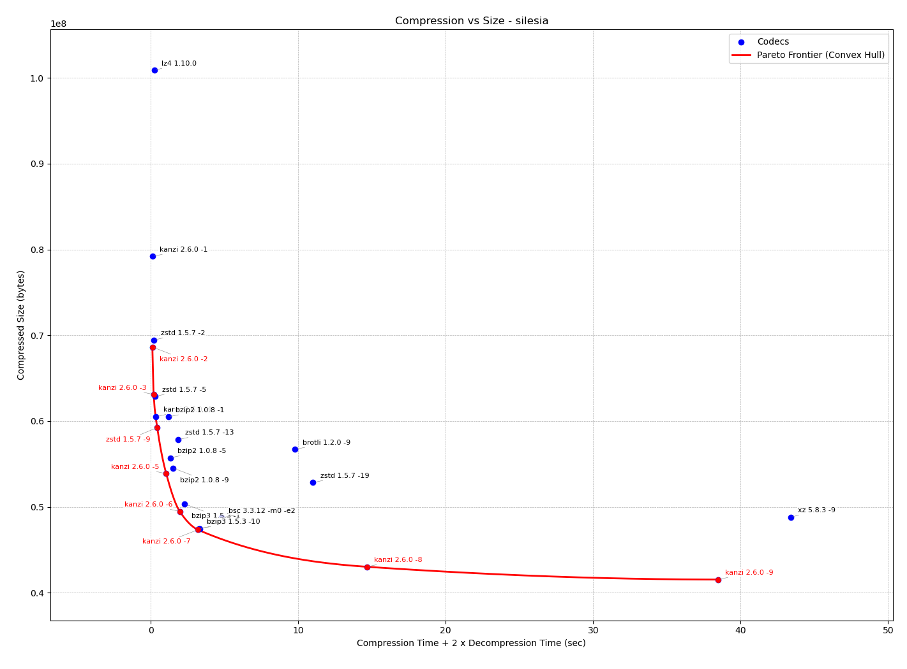
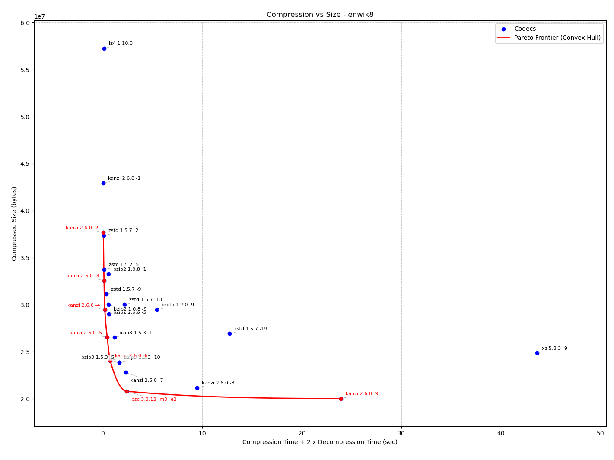

# Kanzi

Kanzi is a modern, modular, portable, and efficient lossless data compressor written in C++.

* Modern: Kanzi implements state-of-the-art compression algorithms and is built to fully utilize multi-core CPUs via built-in multi-threading.
* Modular: Entropy codecs and data transforms can be selected and combined at runtime to best suit the specific data being compressed.
* Portable: Supports a wide range of operating systems, compilers, and C++ standards (details below).
* Expandable: A clean, interface-driven design—with no external dependencies—makes Kanzi easy to integrate, extend, and customize.
* Efficient: Carefully optimized to balance compression ratio and speed for practical, high-performance usage.

Unlike most mainstream lossless compressors, Kanzi is not limited to a single compression paradigm. By combining multiple algorithms and techniques, it supports a broader range of compression ratios and adapts better to diverse data types.

Most traditional compressors underutilize modern hardware by running single-threaded—even on machines with many cores. Kanzi, in contrast, is concurrent by design, compressing multiple blocks in parallel across threads for significant performance gains. However, it is not compatible with standard compression formats.

It’s important to note that Kanzi is a data compressor, not an archiver. It includes optional checksums for verifying data integrity, but does not provide features like cross-file deduplication or data recovery mechanisms. That said, it produces a seekable bitstream, meaning one or more consecutive blocks can be decompressed independently, without needing to process the entire stream.

For more details, see [Wiki](https://github.com/flanglet/kanzi-cpp/wiki), [Q&A](https://github.com/flanglet/kanzi-cpp/wiki/q&a) and [DeepWiki](https://deepwiki.com/flanglet/kanzi-cpp/1-overview)

See how to reuse the C and C++ APIs: [here](https://github.com/flanglet/kanzi-cpp/wiki/Using-and-extending-the-code)

There is a Java implementation available here: https://github.com/flanglet/kanzi

There is a Go implementation available here: https://github.com/flanglet/kanzi-go


[](https://sonarcloud.io/summary/new_code?id=flanglet_kanzi-cpp)
[](https://sonarcloud.io/summary/new_code?id=flanglet_kanzi-cpp)
<a href="https://scan.coverity.com/projects/flanglet-kanzi-cpp">
  
</a>
[](LICENSE)
[](https://deepwiki.com/flanglet/kanzi-cpp)


## Why Kanzi

While excellent open-source compressors like zstd and brotli exist, they are primarily based on Lempel-Ziv (LZ) algorithms. Zstd, in particular, is a fantastic general-purpose choice known for its speed. However, LZ-based tools have inherent limits regarding compression ratios.

Kanzi offers a compelling alternative for specific high-performance scenarios:

* Beyond LZ: By incorporating Burrows-Wheeler Transform (BWT) and Context Modeling (CM), Kanzi can achieve compression ratios that traditional LZ methods cannot.

* Speed where it counts: While LZ is ideal for "compress once, decompress often" (like software distribution), it often slows down significantly at high compression settings. Kanzi leverages multi-core CPUs to maintain performance, making it highly effective for backups, real-time data generation, and one-off transfers.

* Content-Aware: Kanzi features built-in, customizable transforms for specific data types (e.g., multimedia, DNA, UTF text), improving efficiency where generic compressors fail.

* Extensible: The architecture is developer-friendly, making it straightforward to implement new transforms or entropy codecs for experimentation or niche data types.


## Benchmarks

Kanzi version 2.6.0 C++ implementation

_Note: The default block size at level 9 is 32MB. This limits the number of threads in use, especially with smaller files like enwik8, but all tests below are performed with default values._


### silesia.tar

Test machine:

AMD Ryzen 9 9950X 16-Core Processor running Ubuntu 26.04.1 LTS

zstd was built from latest github sources.

Download at http://sun.aei.polsl.pl/~sdeor/corpus/silesia.zip

|        Compressor               |  Encoding (ms)  |  Decoding (ms)  |      Size        |
|---------------------------------|-----------------|-----------------|------------------|
|Original                         |                 |                 |   211,957,760    |
|lz4 1.1.10 -T16 -4               |        18       |         13      |    79,910,851    |
|**kanzi -l 1**                   |      **74**     |       **41**    |    79,184,957    |
|zstd 1.6.0 -T16 -2               |        57       |         25      |    69,443,247    |
|**kanzi -l 2**                   |      **59**     |       **41**    |    68,627,321    |
|brotli 1.1.0 -2                  |       880       |        333      |    68,040,160    |
|gzip 1.13 -9                     |     10328       |        704      |    67,651,076    |
|**kanzi -l 3**                   |     **102**     |       **55**    |    63,093,409    |
|zstd 1.6.0 -T16 -5               |       136       |         26      |    62,867,556    |
|**kanzi -l 4**                   |     **178**     |       **90**    |    60,518,857    |
|zstd 1.6.0 -T16 -9               |       322       |         24      |    59,233,481    |
|brotli 1.1.0 -6                  |      4039       |        299      |    58,511,709    |
|zstd 1.6.0 -T16 -13              |      1820       |         26      |    57,843,283    |
|brotli 1.1.0 -9                  |     23030       |        293      |    56,407,229    |
|bzip2 1.0.8 -9                   |      8223       |       3453      |    54,588,597    |
|**kanzi -l 5**                   |     **569**     |      **275**    |    53,863,205    |
|zstd 1.6.0 -T16 -19              |     11090       |         23      |    52,830,213    |
|**kanzi -l 6**                   |     **922**     |      **523**    |    49,472,110    |
|xz 5.8.1 -9                      |     43611       |        931      |    48,802,580    |
|bsc 3.3.11 -T16                  |      1201       |        698      |    47,900,848    |
|**kanzi -l 7**                   |    **1150**     |      **885**    |    47,330,431    |
|bzip3 1.5.1.r3-g428f422 -j 16    |      2348       |       2218      |    47,260,281    |
|**kanzi -l 8**                   |    **4484**     |     **4911**    |    43,015,393    |
|**kanzi -l 9**                   |   **11918**     |    **12665**    |    41,531,309    |




Round-trip graph for Silesia on AMD Ryzen 9950X (X = compTime + 2*decompTime, Y = comp size)


### enwik8

Test machine:

AMD Ryzen 9 9950X 16-Core Processor running Ubuntu 26.04.1 LTS

Download at https://mattmahoney.net/dc/enwik8.zip

|   Compressor    | Encoding (ms)  | Decoding (ms)  |    Size      |
|-----------------|----------------|----------------|--------------|
|Original         |                |                |  100,000,000 |
|kanzi -l 1       |        45      |         22     |   42,941,668 |
|kanzi -l 2       |        40      |         23     |   37,688,371 |
|kanzi -l 3       |        78      |         36     |   32,562,496 |
|kanzi -l 4       |       101      |         65     |   29,466,291 |
|kanzi -l 5       |       224      |        136     |   26,521,279 |
|kanzi -l 6       |       351      |        252     |   24,076,777 |
|kanzi -l 7       |       871      |        691     |   22,817,366 |
|kanzi -l 8       |      2985      |       3210     |   21,181,998 |
|kanzi -l 9       |      7163      |       7721     |   20,035,687 |




Round-trip graph for enwik8 on AMD Ryzen 9950X  (X = compTime + 2*decompTime, Y = comp size)


### More benchmarks

[Comprehensive lzbench benchmarks](https://github.com/flanglet/kanzi-cpp/wiki/Performance)

[More round trip scores](https://github.com/flanglet/kanzi-cpp/wiki/Round%E2%80%90trips-scores)


## Build Kanzi

* Platforms: Windows (Visual Studio), Linux, macOS, BSD
* Dependencies: None.
* Portability: Designed for easy porting to other OSs.
* Multithreading: Supported by default.

### Visual Studio
The Visual Studio solution and project files are in the `msvc` directory. Open the
solution corresponding to your Visual Studio version:

* Visual Studio 2008: open `msvc/Kanzi_VS2008.sln`. The solution generates a Windows
  32-bit binary. Multithreading is not supported with this version.
* Visual Studio 2022: open `msvc/Kanzi_VS2022.sln`. The solution generates Windows
  binaries and a 64-bit library.
* Visual Studio 2026: open `msvc/Kanzi_VS2026.sln`. The solution generates Windows
  binaries and a 64-bit library.

Select the desired configuration and platform in Visual Studio, then build the
solution.

To build from the command line, open a Developer Command Prompt for the
corresponding Visual Studio version and run the following from the repository
root:

```text
msbuild msvc\Kanzi_VS2022.sln /m /p:Configuration=Release /p:Platform=x64
msbuild msvc\Kanzi_VS2026.sln /m /p:Configuration=Release /p:Platform=x64
```

Use `/p:Platform=Win32` to build the 32-bit target. For Visual Studio 2008,
use the Visual Studio command-line executable instead:

```text
VCExpress.exe msvc\Kanzi_VS2008.sln /Build "Debug|Win32"
```

### mingw-w64
Go to the source directory and run 'make clean && mingw32-make.exe kanzi'. The Makefile contains
all the necessary targets. Tested successfully on Win64 with mingw-w64 g++ 8.1.0.
Multithreading is supported with g++ version 5.0.0 or newer.
Builds successfully with C++11, C++14, C++17.

### Linux
Go to the source directory and run 'make clean && make kanzi'. The Makefile contains all the necessary
targets. Build successfully on Ubuntu with many versions of g++ and clang++.
Multithreading is supported with g++ version 5.0.0 or newer.
Builds successfully with C++98, C++11, C++14, C++17, C++20.

### macOS
Go to the source directory and run 'make clean && make kanzi'. The Makefile contains all the necessary
targets. Build successfully on MacOs with several versions of clang++.
Builds successfully with C++98, C++11, C++14, C++17, C++20.

### BSD
The makefile uses the gnu-make syntax. First, make sure gmake is present (or install it: 'pkg install gmake').
Go to the source directory and run 'gmake clean && gmake kanzi'. The Makefile contains all the necessary
targets. Builds successfully with C++98, C++11, C++14, C++17, C++20.

### Makefile targets
```
clean:          removes objects, libraries and binaries
kanzi:          builds the kanzi executable
kanzi_static:   builds a statically linked executable
kanzi_dynamic:  builds a dynamically linked executable
lib:            builds static and dynamic libraries
test:           builds test binaries
all:            kanzi + kanzi_static + kanzi_dynamic + lib + test
install:        installs libraries, headers and executable
uninstall:      removes installed libraries, headers and executable
```

For those who prefer cmake, run the following commands from the top directory:
```
mkdir build
cd build
cmake ..
make
ctest
```
By default, the cmake build generates a dynamically linked executable.
Choose ```make kanzi_static``` to build a statically linked executable.

Credits

Matt Mahoney,
Yann Collet,
Jan Ondrus,
Yuta Mori,
Ilya Muravyov,
Neal Burns,
Fabian Giesen,
Jarek Duda,
Ilya Grebnov

Disclaimer

Use at your own risk. Always keep a copy of your original files.
